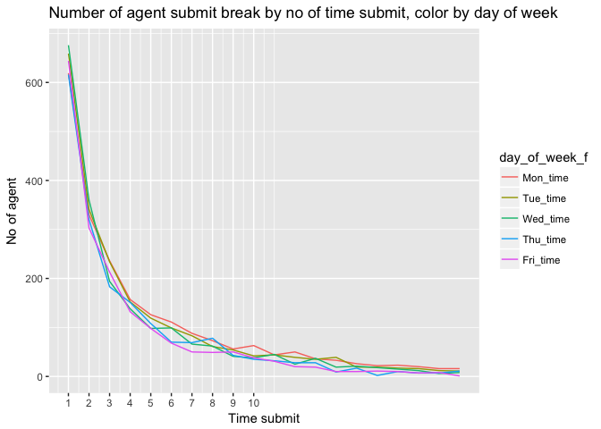
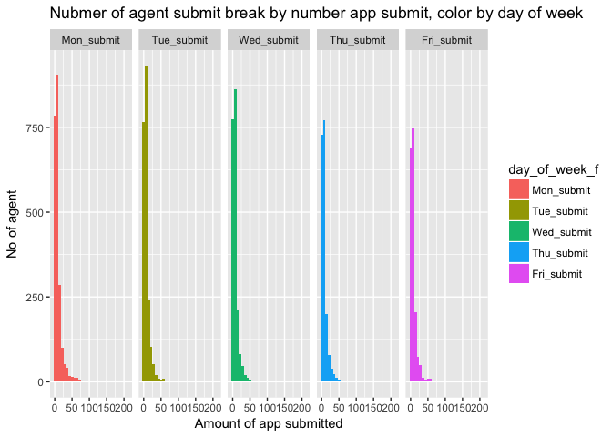
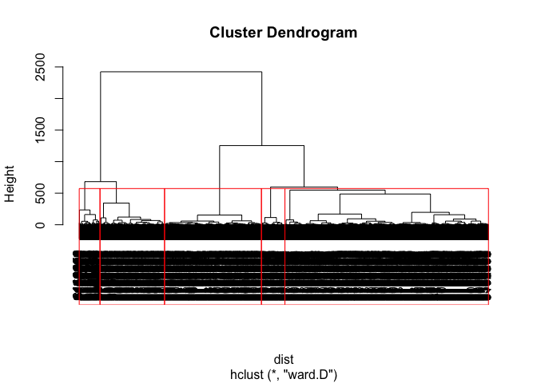
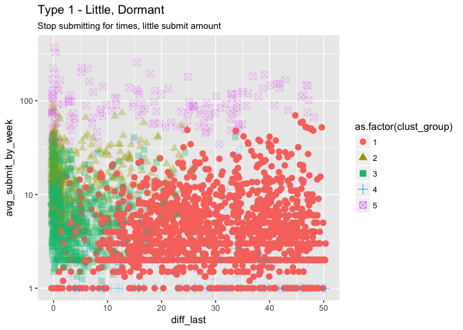
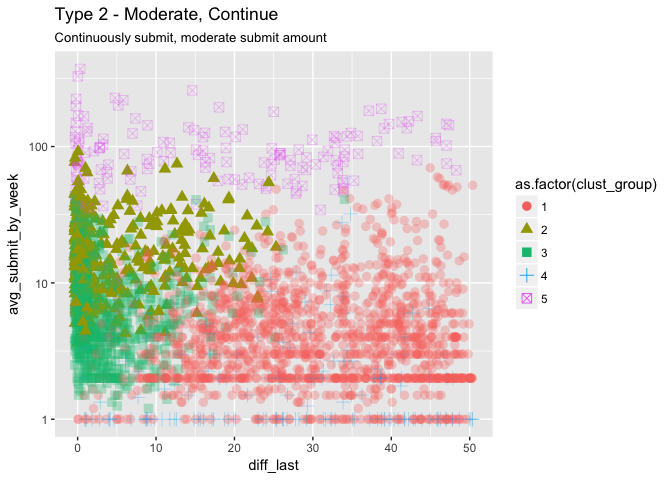
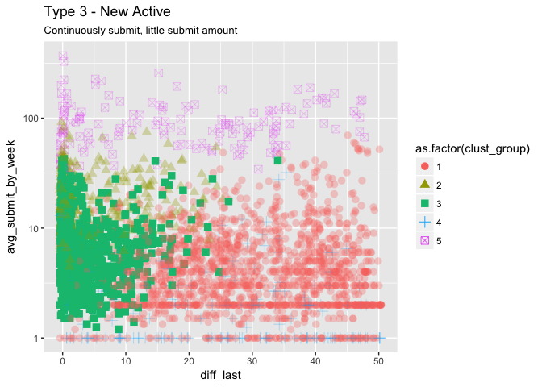
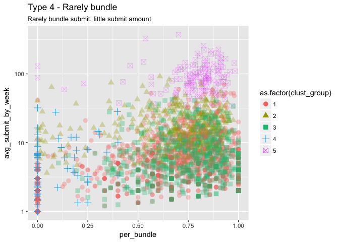
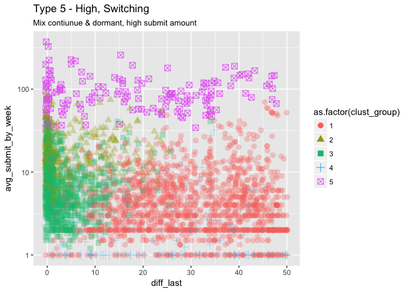
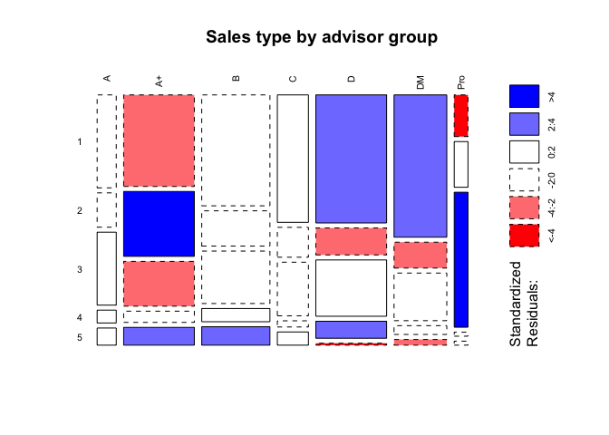
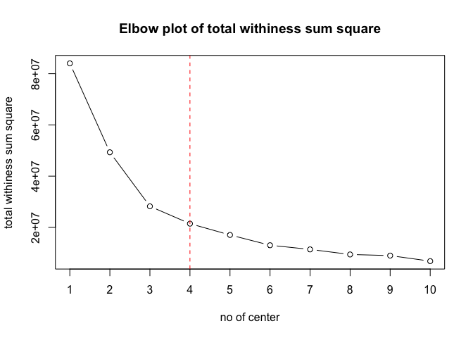

# Initialize Project

```r
# Uncomment lines below if rmd file is placed in a subdirectory
# library(knitr)
# opts_knit$set(root.dir = normalizePath('../')) 
```


# Explore
## No of app received by # week in year, colored by month

```
## 
## Attaching package: 'plotly'
```

```
## The following object is masked from 'package:ggplot2':
## 
##     last_plot
```

```
## The following object is masked from 'package:stats':
## 
##     filter
```

```
## The following object is masked from 'package:graphics':
## 
##     layout
```

```
## Warning: Ignoring unknown parameters: binwidth, bins, pad
```

```
## We recommend that you use the dev version of ggplot2 with `ggplotly()`
## Install it with: `devtools::install_github('hadley/ggplot2')`
```

<!--html_preserve--><div id="48b6ecf50a" style="width:672px;height:480px;" class="plotly html-widget"></div>
<script type="application/json" data-for="48b6ecf50a">{"x":{"data":[{"orientation":"v","width":[0.9,0.9,0.9,0.9,0.9],"base":[0,0,0,0,5912],"x":[1,2,3,4,5],"y":[4381,10345,12503,12978,6342],"text":["count:  4381<br />no_week_of_year:  1<br />as.factor(month): 01","count: 10345<br />no_week_of_year:  2<br />as.factor(month): 01","count: 12503<br />no_week_of_year:  3<br />as.factor(month): 01","count: 12978<br />no_week_of_year:  4<br />as.factor(month): 01","count:  6342<br />no_week_of_year:  5<br />as.factor(month): 01"],"type":"bar","marker":{"autocolorscale":false,"color":"rgba(248,118,109,1)","line":{"width":1.88976377952756,"color":"transparent"}},"name":"01","legendgroup":"01","showlegend":true,"xaxis":"x","yaxis":"y","hoverinfo":"text","frame":null},{"orientation":"v","width":[0.9,0.9,0.9,0.899999999999999,0.899999999999999],"base":[0,0,0,0,5552],"x":[5,6,7,8,9],"y":[5912,14091,13239,14729,6930],"text":["count:  5912<br />no_week_of_year:  5<br />as.factor(month): 02","count: 14091<br />no_week_of_year:  6<br />as.factor(month): 02","count: 13239<br />no_week_of_year:  7<br />as.factor(month): 02","count: 14729<br />no_week_of_year:  8<br />as.factor(month): 02","count:  6930<br />no_week_of_year:  9<br />as.factor(month): 02"],"type":"bar","marker":{"autocolorscale":false,"color":"rgba(222,140,0,1)","line":{"width":1.88976377952756,"color":"transparent"}},"name":"02","legendgroup":"02","showlegend":true,"xaxis":"x","yaxis":"y","hoverinfo":"text","frame":null},{"orientation":"v","width":[0.899999999999999,0.899999999999999,0.899999999999999,0.899999999999999,0.899999999999999],"base":[0,0,0,0,0],"x":[9,10,11,12,13],"y":[5552,14461,14474,14106,12353],"text":["count:  5552<br />no_week_of_year:  9<br />as.factor(month): 03","count: 14461<br />no_week_of_year: 10<br />as.factor(month): 03","count: 14474<br />no_week_of_year: 11<br />as.factor(month): 03","count: 14106<br />no_week_of_year: 12<br />as.factor(month): 03","count: 12353<br />no_week_of_year: 13<br />as.factor(month): 03"],"type":"bar","marker":{"autocolorscale":false,"color":"rgba(183,159,0,1)","line":{"width":1.88976377952756,"color":"transparent"}},"name":"03","legendgroup":"03","showlegend":true,"xaxis":"x","yaxis":"y","hoverinfo":"text","frame":null},{"orientation":"v","width":[0.899999999999999,0.899999999999999,0.899999999999999,0.899999999999999],"base":[0,0,0,0],"x":[14,15,16,17],"y":[12443,7460,7528,12072],"text":["count: 12443<br />no_week_of_year: 14<br />as.factor(month): 04","count:  7460<br />no_week_of_year: 15<br />as.factor(month): 04","count:  7528<br />no_week_of_year: 16<br />as.factor(month): 04","count: 12072<br />no_week_of_year: 17<br />as.factor(month): 04"],"type":"bar","marker":{"autocolorscale":false,"color":"rgba(124,174,0,1)","line":{"width":1.88976377952756,"color":"transparent"}},"name":"04","legendgroup":"04","showlegend":true,"xaxis":"x","yaxis":"y","hoverinfo":"text","frame":null},{"orientation":"v","width":[0.899999999999999,0.899999999999999,0.899999999999999,0.899999999999999,0.899999999999999],"base":[0,0,0,0,3514],"x":[18,19,20,21,22],"y":[9485,10509,12356,12911,7883],"text":["count:  9485<br />no_week_of_year: 18<br />as.factor(month): 05","count: 10509<br />no_week_of_year: 19<br />as.factor(month): 05","count: 12356<br />no_week_of_year: 20<br />as.factor(month): 05","count: 12911<br />no_week_of_year: 21<br />as.factor(month): 05","count:  7883<br />no_week_of_year: 22<br />as.factor(month): 05"],"type":"bar","marker":{"autocolorscale":false,"color":"rgba(0,186,56,1)","line":{"width":1.88976377952756,"color":"transparent"}},"name":"05","legendgroup":"05","showlegend":true,"xaxis":"x","yaxis":"y","hoverinfo":"text","frame":null},{"orientation":"v","width":[0.899999999999999,0.899999999999999,0.899999999999999,0.899999999999999,0.899999999999999],"base":[0,0,0,0,0],"x":[22,23,24,25,26],"y":[3514,12366,13235,13404,11859],"text":["count:  3514<br />no_week_of_year: 22<br />as.factor(month): 06","count: 12366<br />no_week_of_year: 23<br />as.factor(month): 06","count: 13235<br />no_week_of_year: 24<br />as.factor(month): 06","count: 13404<br />no_week_of_year: 25<br />as.factor(month): 06","count: 11859<br />no_week_of_year: 26<br />as.factor(month): 06"],"type":"bar","marker":{"autocolorscale":false,"color":"rgba(0,192,139,1)","line":{"width":1.88976377952756,"color":"transparent"}},"name":"06","legendgroup":"06","showlegend":true,"xaxis":"x","yaxis":"y","hoverinfo":"text","frame":null},{"orientation":"v","width":[0.899999999999999,0.899999999999999,0.899999999999999,0.899999999999999,0.899999999999999],"base":[0,0,0,0,6714],"x":[27,28,29,30,31],"y":[12306,10759,11620,11031,3804],"text":["count: 12306<br />no_week_of_year: 27<br />as.factor(month): 07","count: 10759<br />no_week_of_year: 28<br />as.factor(month): 07","count: 11620<br />no_week_of_year: 29<br />as.factor(month): 07","count: 11031<br />no_week_of_year: 30<br />as.factor(month): 07","count:  3804<br />no_week_of_year: 31<br />as.factor(month): 07"],"type":"bar","marker":{"autocolorscale":false,"color":"rgba(0,191,196,1)","line":{"width":1.88976377952756,"color":"transparent"}},"name":"07","legendgroup":"07","showlegend":true,"xaxis":"x","yaxis":"y","hoverinfo":"text","frame":null},{"orientation":"v","width":[0.899999999999999,0.900000000000002,0.900000000000006,0.900000000000006,0.900000000000006],"base":[0,0,0,0,1146],"x":[31,32,33,34,35],"y":[6714,13214,10658,12527,10365],"text":["count:  6714<br />no_week_of_year: 31<br />as.factor(month): 08","count: 13214<br />no_week_of_year: 32<br />as.factor(month): 08","count: 10658<br />no_week_of_year: 33<br />as.factor(month): 08","count: 12527<br />no_week_of_year: 34<br />as.factor(month): 08","count: 10365<br />no_week_of_year: 35<br />as.factor(month): 08"],"type":"bar","marker":{"autocolorscale":false,"color":"rgba(0,180,240,1)","line":{"width":1.88976377952756,"color":"transparent"}},"name":"08","legendgroup":"08","showlegend":true,"xaxis":"x","yaxis":"y","hoverinfo":"text","frame":null},{"orientation":"v","width":[0.900000000000006,0.900000000000006,0.900000000000006,0.900000000000006,0.900000000000006],"base":[0,0,0,0,0],"x":[35,36,37,38,39],"y":[1146,9770,9558,10360,10564],"text":["count:  1146<br />no_week_of_year: 35<br />as.factor(month): 09","count:  9770<br />no_week_of_year: 36<br />as.factor(month): 09","count:  9558<br />no_week_of_year: 37<br />as.factor(month): 09","count: 10360<br />no_week_of_year: 38<br />as.factor(month): 09","count: 10564<br />no_week_of_year: 39<br />as.factor(month): 09"],"type":"bar","marker":{"autocolorscale":false,"color":"rgba(97,156,255,1)","line":{"width":1.88976377952756,"color":"transparent"}},"name":"09","legendgroup":"09","showlegend":true,"xaxis":"x","yaxis":"y","hoverinfo":"text","frame":null},{"orientation":"v","width":[0.900000000000006,0.900000000000006,0.900000000000006,0.900000000000006,0.900000000000006],"base":[0,0,0,0,3537],"x":[40,41,42,43,44],"y":[10617,9812,12031,8874,4594],"text":["count: 10617<br />no_week_of_year: 40<br />as.factor(month): 10","count:  9812<br />no_week_of_year: 41<br />as.factor(month): 10","count: 12031<br />no_week_of_year: 42<br />as.factor(month): 10","count:  8874<br />no_week_of_year: 43<br />as.factor(month): 10","count:  4594<br />no_week_of_year: 44<br />as.factor(month): 10"],"type":"bar","marker":{"autocolorscale":false,"color":"rgba(199,124,255,1)","line":{"width":1.88976377952756,"color":"transparent"}},"name":"10","legendgroup":"10","showlegend":true,"xaxis":"x","yaxis":"y","hoverinfo":"text","frame":null},{"orientation":"v","width":[0.900000000000006,0.900000000000006,0.900000000000006,0.900000000000006,0.900000000000006],"base":[0,0,0,0,998],"x":[44,45,46,47,48],"y":[3537,10314,11098,10492,8012],"text":["count:  3537<br />no_week_of_year: 44<br />as.factor(month): 11","count: 10314<br />no_week_of_year: 45<br />as.factor(month): 11","count: 11098<br />no_week_of_year: 46<br />as.factor(month): 11","count: 10492<br />no_week_of_year: 47<br />as.factor(month): 11","count:  8012<br />no_week_of_year: 48<br />as.factor(month): 11"],"type":"bar","marker":{"autocolorscale":false,"color":"rgba(245,100,227,1)","line":{"width":1.88976377952756,"color":"transparent"}},"name":"11","legendgroup":"11","showlegend":true,"xaxis":"x","yaxis":"y","hoverinfo":"text","frame":null},{"orientation":"v","width":[0.900000000000006,0.900000000000006,0.900000000000006,0.900000000000006],"base":[0,0,0,0],"x":[48,49,50,51],"y":[998,9433,9467,6861],"text":["count:   998<br />no_week_of_year: 48<br />as.factor(month): 12","count:  9433<br />no_week_of_year: 49<br />as.factor(month): 12","count:  9467<br />no_week_of_year: 50<br />as.factor(month): 12","count:  6861<br />no_week_of_year: 51<br />as.factor(month): 12"],"type":"bar","marker":{"autocolorscale":false,"color":"rgba(255,100,176,1)","line":{"width":1.88976377952756,"color":"transparent"}},"name":"12","legendgroup":"12","showlegend":true,"xaxis":"x","yaxis":"y","hoverinfo":"text","frame":null}],"layout":{"margin":{"t":43.7625570776256,"r":7.30593607305936,"b":40.1826484018265,"l":54.7945205479452},"plot_bgcolor":"rgba(235,235,235,1)","paper_bgcolor":"rgba(255,255,255,1)","font":{"color":"rgba(0,0,0,1)","family":"","size":14.6118721461187},"title":"No of app submit by # of week in year, colored by month","titlefont":{"color":"rgba(0,0,0,1)","family":"","size":17.5342465753425},"xaxis":{"domain":[0,1],"type":"linear","autorange":false,"tickmode":"array","range":[-1.995,53.995],"ticktext":["0","10","20","30","40","50"],"tickvals":[0,10,20,30,40,50],"ticks":"outside","tickcolor":"rgba(51,51,51,1)","ticklen":3.65296803652968,"tickwidth":0.66417600664176,"showticklabels":true,"tickfont":{"color":"rgba(77,77,77,1)","family":"","size":11.689497716895},"tickangle":-0,"showline":false,"linecolor":null,"linewidth":0,"showgrid":true,"gridcolor":"rgba(255,255,255,1)","gridwidth":0.66417600664176,"zeroline":false,"anchor":"y","title":"No of week in year","titlefont":{"color":"rgba(0,0,0,1)","family":"","size":14.6118721461187},"hoverformat":".2f"},"yaxis":{"domain":[0,1],"type":"linear","autorange":false,"tickmode":"array","range":[-736.45,15465.45],"ticktext":["0","5000","10000","15000"],"tickvals":[0,5000,10000,15000],"ticks":"outside","tickcolor":"rgba(51,51,51,1)","ticklen":3.65296803652968,"tickwidth":0.66417600664176,"showticklabels":true,"tickfont":{"color":"rgba(77,77,77,1)","family":"","size":11.689497716895},"tickangle":-0,"showline":false,"linecolor":null,"linewidth":0,"showgrid":true,"gridcolor":"rgba(255,255,255,1)","gridwidth":0.66417600664176,"zeroline":false,"anchor":"x","title":"No app submit","titlefont":{"color":"rgba(0,0,0,1)","family":"","size":14.6118721461187},"hoverformat":".2f"},"shapes":[{"type":"rect","fillcolor":null,"line":{"color":null,"width":0,"linetype":[]},"yref":"paper","xref":"paper","x0":0,"x1":1,"y0":0,"y1":1}],"showlegend":true,"legend":{"bgcolor":"rgba(255,255,255,1)","bordercolor":"transparent","borderwidth":1.88976377952756,"font":{"color":"rgba(0,0,0,1)","family":"","size":11.689497716895},"y":0.913385826771654},"annotations":[{"text":"Month","x":1.02,"y":1,"showarrow":false,"ax":0,"ay":0,"font":{"color":"rgba(0,0,0,1)","family":"","size":14.6118721461187},"xref":"paper","yref":"paper","textangle":-0,"xanchor":"left","yanchor":"bottom","legendTitle":true}],"barmode":"stack","bargap":0,"hovermode":"closest"},"source":"A","attrs":{"48b56538b85":{"x":{},"fill":{},"type":"ggplotly"}},"cur_data":"48b56538b85","visdat":{"48b56538b85":["function (y) ","x"]},"config":{"modeBarButtonsToAdd":[{"name":"Collaborate","icon":{"width":1000,"ascent":500,"descent":-50,"path":"M487 375c7-10 9-23 5-36l-79-259c-3-12-11-23-22-31-11-8-22-12-35-12l-263 0c-15 0-29 5-43 15-13 10-23 23-28 37-5 13-5 25-1 37 0 0 0 3 1 7 1 5 1 8 1 11 0 2 0 4-1 6 0 3-1 5-1 6 1 2 2 4 3 6 1 2 2 4 4 6 2 3 4 5 5 7 5 7 9 16 13 26 4 10 7 19 9 26 0 2 0 5 0 9-1 4-1 6 0 8 0 2 2 5 4 8 3 3 5 5 5 7 4 6 8 15 12 26 4 11 7 19 7 26 1 1 0 4 0 9-1 4-1 7 0 8 1 2 3 5 6 8 4 4 6 6 6 7 4 5 8 13 13 24 4 11 7 20 7 28 1 1 0 4 0 7-1 3-1 6-1 7 0 2 1 4 3 6 1 1 3 4 5 6 2 3 3 5 5 6 1 2 3 5 4 9 2 3 3 7 5 10 1 3 2 6 4 10 2 4 4 7 6 9 2 3 4 5 7 7 3 2 7 3 11 3 3 0 8 0 13-1l0-1c7 2 12 2 14 2l218 0c14 0 25-5 32-16 8-10 10-23 6-37l-79-259c-7-22-13-37-20-43-7-7-19-10-37-10l-248 0c-5 0-9-2-11-5-2-3-2-7 0-12 4-13 18-20 41-20l264 0c5 0 10 2 16 5 5 3 8 6 10 11l85 282c2 5 2 10 2 17 7-3 13-7 17-13z m-304 0c-1-3-1-5 0-7 1-1 3-2 6-2l174 0c2 0 4 1 7 2 2 2 4 4 5 7l6 18c0 3 0 5-1 7-1 1-3 2-6 2l-173 0c-3 0-5-1-8-2-2-2-4-4-4-7z m-24-73c-1-3-1-5 0-7 2-2 3-2 6-2l174 0c2 0 5 0 7 2 3 2 4 4 5 7l6 18c1 2 0 5-1 6-1 2-3 3-5 3l-174 0c-3 0-5-1-7-3-3-1-4-4-5-6z"},"click":"function(gd) { \n        // is this being viewed in RStudio?\n        if (location.search == '?viewer_pane=1') {\n          alert('To learn about plotly for collaboration, visit:\\n https://cpsievert.github.io/plotly_book/plot-ly-for-collaboration.html');\n        } else {\n          window.open('https://cpsievert.github.io/plotly_book/plot-ly-for-collaboration.html', '_blank');\n        }\n      }"}],"cloud":false},"highlight":{"on":"plotly_click","persistent":false,"dynamic":false,"selectize":false,"opacityDim":0.2,"selected":{"opacity":1}},"base_url":"https://plot.ly"},"evals":["config.modeBarButtonsToAdd.0.click"],"jsHooks":{"render":[{"code":"function(el, x) { var ctConfig = crosstalk.var('plotlyCrosstalkOpts').set({\"on\":\"plotly_click\",\"persistent\":false,\"dynamic\":false,\"selectize\":false,\"opacityDim\":0.2,\"selected\":{\"opacity\":1}}); }","data":null}]}}</script><!--/html_preserve-->

## No of app rcvd by # of week in year, colored by source code

```
## Warning: Ignoring unknown parameters: binwidth, bins, pad
```

```
## We recommend that you use the dev version of ggplot2 with `ggplotly()`
## Install it with: `devtools::install_github('hadley/ggplot2')`
```

<!--html_preserve--><div id="48b4d5fb4e8" style="width:672px;height:480px;" class="plotly html-widget"></div>
<script type="application/json" data-for="48b4d5fb4e8">{"x":{"data":[{"orientation":"v","width":[0.9,0.9,0.9,0.9,0.9,0.9,0.9,0.899999999999999,0.899999999999999,0.899999999999999,0.899999999999999,0.899999999999999,0.899999999999999,0.899999999999999,0.899999999999999,0.899999999999999,0.899999999999999,0.899999999999999,0.899999999999999,0.899999999999999,0.899999999999999,0.899999999999999,0.899999999999999,0.899999999999999,0.899999999999999,0.899999999999999,0.899999999999999,0.899999999999999,0.899999999999999,0.899999999999999,0.900000000000002,0.900000000000006,0.900000000000006,0.900000000000006,0.900000000000006,0.900000000000006,0.900000000000006,0.900000000000006,0.900000000000006,0.900000000000006,0.900000000000006,0.900000000000006,0.900000000000006,0.900000000000006,0.900000000000006,0.900000000000006,0.900000000000006,0.900000000000006,0.900000000000006,0.900000000000006],"base":[0,0,0,0,0,0,0,0,0,0,0,0,0,0,0,0,0,0,0,0,0,0,0,0,0,0,0,0,0,0,0,0,0,0,0,0,0,0,0,0,0,0,0,0,0,0,0,0,0,0],"x":[1,2,3,4,5,6,7,8,9,10,11,12,13,14,15,16,17,18,19,20,21,22,23,24,25,26,27,28,29,31,32,33,34,35,36,37,38,39,40,41,42,43,44,45,46,47,48,49,50,51],"y":[16,41,43,41,52,43,55,83,61,104,92,53,37,28,7,23,27,17,7,8,5,8,3,108,34,3,23,6,3,10,28,37,9,23,24,17,25,2,19,10,28,58,76,49,39,15,14,30,14,9],"text":["count:    16<br />no_week_of_year:  1<br />as.factor(source_code): OCS","count:    41<br />no_week_of_year:  2<br />as.factor(source_code): OCS","count:    43<br />no_week_of_year:  3<br />as.factor(source_code): OCS","count:    41<br />no_week_of_year:  4<br />as.factor(source_code): OCS","count:    52<br />no_week_of_year:  5<br />as.factor(source_code): OCS","count:    43<br />no_week_of_year:  6<br />as.factor(source_code): OCS","count:    55<br />no_week_of_year:  7<br />as.factor(source_code): OCS","count:    83<br />no_week_of_year:  8<br />as.factor(source_code): OCS","count:    61<br />no_week_of_year:  9<br />as.factor(source_code): OCS","count:   104<br />no_week_of_year: 10<br />as.factor(source_code): OCS","count:    92<br />no_week_of_year: 11<br />as.factor(source_code): OCS","count:    53<br />no_week_of_year: 12<br />as.factor(source_code): OCS","count:    37<br />no_week_of_year: 13<br />as.factor(source_code): OCS","count:    28<br />no_week_of_year: 14<br />as.factor(source_code): OCS","count:     7<br />no_week_of_year: 15<br />as.factor(source_code): OCS","count:    23<br />no_week_of_year: 16<br />as.factor(source_code): OCS","count:    27<br />no_week_of_year: 17<br />as.factor(source_code): OCS","count:    17<br />no_week_of_year: 18<br />as.factor(source_code): OCS","count:     7<br />no_week_of_year: 19<br />as.factor(source_code): OCS","count:     8<br />no_week_of_year: 20<br />as.factor(source_code): OCS","count:     5<br />no_week_of_year: 21<br />as.factor(source_code): OCS","count:     8<br />no_week_of_year: 22<br />as.factor(source_code): OCS","count:     3<br />no_week_of_year: 23<br />as.factor(source_code): OCS","count:   108<br />no_week_of_year: 24<br />as.factor(source_code): OCS","count:    34<br />no_week_of_year: 25<br />as.factor(source_code): OCS","count:     3<br />no_week_of_year: 26<br />as.factor(source_code): OCS","count:    23<br />no_week_of_year: 27<br />as.factor(source_code): OCS","count:     6<br />no_week_of_year: 28<br />as.factor(source_code): OCS","count:     3<br />no_week_of_year: 29<br />as.factor(source_code): OCS","count:    10<br />no_week_of_year: 31<br />as.factor(source_code): OCS","count:    28<br />no_week_of_year: 32<br />as.factor(source_code): OCS","count:    37<br />no_week_of_year: 33<br />as.factor(source_code): OCS","count:     9<br />no_week_of_year: 34<br />as.factor(source_code): OCS","count:    23<br />no_week_of_year: 35<br />as.factor(source_code): OCS","count:    24<br />no_week_of_year: 36<br />as.factor(source_code): OCS","count:    17<br />no_week_of_year: 37<br />as.factor(source_code): OCS","count:    25<br />no_week_of_year: 38<br />as.factor(source_code): OCS","count:     2<br />no_week_of_year: 39<br />as.factor(source_code): OCS","count:    19<br />no_week_of_year: 40<br />as.factor(source_code): OCS","count:    10<br />no_week_of_year: 41<br />as.factor(source_code): OCS","count:    28<br />no_week_of_year: 42<br />as.factor(source_code): OCS","count:    58<br />no_week_of_year: 43<br />as.factor(source_code): OCS","count:    76<br />no_week_of_year: 44<br />as.factor(source_code): OCS","count:    49<br />no_week_of_year: 45<br />as.factor(source_code): OCS","count:    39<br />no_week_of_year: 46<br />as.factor(source_code): OCS","count:    15<br />no_week_of_year: 47<br />as.factor(source_code): OCS","count:    14<br />no_week_of_year: 48<br />as.factor(source_code): OCS","count:    30<br />no_week_of_year: 49<br />as.factor(source_code): OCS","count:    14<br />no_week_of_year: 50<br />as.factor(source_code): OCS","count:     9<br />no_week_of_year: 51<br />as.factor(source_code): OCS"],"type":"bar","marker":{"autocolorscale":false,"color":"rgba(248,118,109,1)","line":{"width":1.88976377952756,"color":"transparent"}},"name":"OCS","legendgroup":"OCS","showlegend":true,"xaxis":"x","yaxis":"y","hoverinfo":"text","frame":null},{"orientation":"v","width":[0.9,0.9,0.9,0.9,0.9,0.9,0.9,0.899999999999999,0.899999999999999,0.899999999999999,0.899999999999999,0.899999999999999,0.899999999999999,0.899999999999999,0.899999999999999,0.899999999999999,0.899999999999999,0.899999999999999,0.899999999999999,0.899999999999999,0.899999999999999,0.899999999999999,0.899999999999999,0.899999999999999,0.899999999999999,0.899999999999999,0.899999999999999,0.899999999999999,0.899999999999999,0.899999999999999,0.899999999999999,0.900000000000002,0.900000000000006,0.900000000000006,0.900000000000006,0.900000000000006,0.900000000000006,0.900000000000006,0.900000000000006,0.900000000000006,0.900000000000006,0.900000000000006,0.900000000000006,0.900000000000006,0.900000000000006,0.900000000000006,0.900000000000006,0.900000000000006,0.900000000000006,0.900000000000006,0.900000000000006],"base":[0,0,0,0,0,0,0,0,0,0,0,0,0,0,0,0,0,0,0,0,0,0,0,0,0,0,0,0,0,0,0,0,0,0,0,0,0,0,0,0,0,0,0,0,0,0,0,0,0,0,0],"x":[1,2,3,4,5,6,7,8,9,10,11,12,13,14,15,16,17,18,19,20,21,22,23,24,25,26,27,28,29,30,31,32,33,34,35,36,37,38,39,40,41,42,43,44,45,46,47,48,49,50,51],"y":[436,1236,1335,1415,1317,1279,1250,1252,1369,1176,1413,1304,1348,1024,859,964,1159,935,1064,1313,1249,1264,1443,1378,1521,1450,1465,1168,1067,804,1159,1549,1098,1419,1152,911,1005,938,890,797,727,938,540,627,733,843,757,711,624,687,663],"text":["count:   436<br />no_week_of_year:  1<br />as.factor(source_code): OGS","count:  1236<br />no_week_of_year:  2<br />as.factor(source_code): OGS","count:  1335<br />no_week_of_year:  3<br />as.factor(source_code): OGS","count:  1415<br />no_week_of_year:  4<br />as.factor(source_code): OGS","count:  1317<br />no_week_of_year:  5<br />as.factor(source_code): OGS","count:  1279<br />no_week_of_year:  6<br />as.factor(source_code): OGS","count:  1250<br />no_week_of_year:  7<br />as.factor(source_code): OGS","count:  1252<br />no_week_of_year:  8<br />as.factor(source_code): OGS","count:  1369<br />no_week_of_year:  9<br />as.factor(source_code): OGS","count:  1176<br />no_week_of_year: 10<br />as.factor(source_code): OGS","count:  1413<br />no_week_of_year: 11<br />as.factor(source_code): OGS","count:  1304<br />no_week_of_year: 12<br />as.factor(source_code): OGS","count:  1348<br />no_week_of_year: 13<br />as.factor(source_code): OGS","count:  1024<br />no_week_of_year: 14<br />as.factor(source_code): OGS","count:   859<br />no_week_of_year: 15<br />as.factor(source_code): OGS","count:   964<br />no_week_of_year: 16<br />as.factor(source_code): OGS","count:  1159<br />no_week_of_year: 17<br />as.factor(source_code): OGS","count:   935<br />no_week_of_year: 18<br />as.factor(source_code): OGS","count:  1064<br />no_week_of_year: 19<br />as.factor(source_code): OGS","count:  1313<br />no_week_of_year: 20<br />as.factor(source_code): OGS","count:  1249<br />no_week_of_year: 21<br />as.factor(source_code): OGS","count:  1264<br />no_week_of_year: 22<br />as.factor(source_code): OGS","count:  1443<br />no_week_of_year: 23<br />as.factor(source_code): OGS","count:  1378<br />no_week_of_year: 24<br />as.factor(source_code): OGS","count:  1521<br />no_week_of_year: 25<br />as.factor(source_code): OGS","count:  1450<br />no_week_of_year: 26<br />as.factor(source_code): OGS","count:  1465<br />no_week_of_year: 27<br />as.factor(source_code): OGS","count:  1168<br />no_week_of_year: 28<br />as.factor(source_code): OGS","count:  1067<br />no_week_of_year: 29<br />as.factor(source_code): OGS","count:   804<br />no_week_of_year: 30<br />as.factor(source_code): OGS","count:  1159<br />no_week_of_year: 31<br />as.factor(source_code): OGS","count:  1549<br />no_week_of_year: 32<br />as.factor(source_code): OGS","count:  1098<br />no_week_of_year: 33<br />as.factor(source_code): OGS","count:  1419<br />no_week_of_year: 34<br />as.factor(source_code): OGS","count:  1152<br />no_week_of_year: 35<br />as.factor(source_code): OGS","count:   911<br />no_week_of_year: 36<br />as.factor(source_code): OGS","count:  1005<br />no_week_of_year: 37<br />as.factor(source_code): OGS","count:   938<br />no_week_of_year: 38<br />as.factor(source_code): OGS","count:   890<br />no_week_of_year: 39<br />as.factor(source_code): OGS","count:   797<br />no_week_of_year: 40<br />as.factor(source_code): OGS","count:   727<br />no_week_of_year: 41<br />as.factor(source_code): OGS","count:   938<br />no_week_of_year: 42<br />as.factor(source_code): OGS","count:   540<br />no_week_of_year: 43<br />as.factor(source_code): OGS","count:   627<br />no_week_of_year: 44<br />as.factor(source_code): OGS","count:   733<br />no_week_of_year: 45<br />as.factor(source_code): OGS","count:   843<br />no_week_of_year: 46<br />as.factor(source_code): OGS","count:   757<br />no_week_of_year: 47<br />as.factor(source_code): OGS","count:   711<br />no_week_of_year: 48<br />as.factor(source_code): OGS","count:   624<br />no_week_of_year: 49<br />as.factor(source_code): OGS","count:   687<br />no_week_of_year: 50<br />as.factor(source_code): OGS","count:   663<br />no_week_of_year: 51<br />as.factor(source_code): OGS"],"type":"bar","marker":{"autocolorscale":false,"color":"rgba(0,186,56,1)","line":{"width":1.88976377952756,"color":"transparent"}},"name":"OGS","legendgroup":"OGS","showlegend":true,"xaxis":"x2","yaxis":"y","hoverinfo":"text","frame":null},{"orientation":"v","width":[0.9,0.9,0.9,0.9,0.9,0.9,0.9,0.899999999999999,0.899999999999999,0.899999999999999,0.899999999999999,0.899999999999999,0.899999999999999,0.899999999999999,0.899999999999999,0.899999999999999,0.899999999999999,0.899999999999999,0.899999999999999,0.899999999999999,0.899999999999999,0.899999999999999,0.899999999999999,0.899999999999999,0.899999999999999,0.899999999999999,0.899999999999999,0.899999999999999,0.899999999999999,0.899999999999999,0.899999999999999,0.900000000000002,0.900000000000006,0.900000000000006,0.900000000000006,0.900000000000006,0.900000000000006,0.900000000000006,0.900000000000006,0.900000000000006,0.900000000000006,0.900000000000006,0.900000000000006,0.900000000000006,0.900000000000006,0.900000000000006,0.900000000000006,0.900000000000006,0.900000000000006,0.900000000000006,0.900000000000006],"base":[0,0,0,0,0,0,0,0,0,0,0,0,0,0,0,0,0,0,0,0,0,0,0,0,0,0,0,0,0,0,0,0,0,0,0,0,0,0,0,0,0,0,0,0,0,0,0,0,0,0,0],"x":[1,2,3,4,5,6,7,8,9,10,11,12,13,14,15,16,17,18,19,20,21,22,23,24,25,26,27,28,29,30,31,32,33,34,35,36,37,38,39,40,41,42,43,44,45,46,47,48,49,50,51],"y":[3924,9028,11102,11512,10856,12755,11926,13361,11023,13148,12944,12745,10965,11391,6593,6522,10877,8524,9412,11019,11638,10114,10915,11743,11836,10398,10808,9569,10537,10219,9341,11635,9507,11092,10336,8832,8536,9397,9669,9799,9072,11065,8276,7414,9528,10216,9707,8281,8779,8762,6184],"text":["count:  3924<br />no_week_of_year:  1<br />as.factor(source_code): OSS","count:  9028<br />no_week_of_year:  2<br />as.factor(source_code): OSS","count: 11102<br />no_week_of_year:  3<br />as.factor(source_code): OSS","count: 11512<br />no_week_of_year:  4<br />as.factor(source_code): OSS","count: 10856<br />no_week_of_year:  5<br />as.factor(source_code): OSS","count: 12755<br />no_week_of_year:  6<br />as.factor(source_code): OSS","count: 11926<br />no_week_of_year:  7<br />as.factor(source_code): OSS","count: 13361<br />no_week_of_year:  8<br />as.factor(source_code): OSS","count: 11023<br />no_week_of_year:  9<br />as.factor(source_code): OSS","count: 13148<br />no_week_of_year: 10<br />as.factor(source_code): OSS","count: 12944<br />no_week_of_year: 11<br />as.factor(source_code): OSS","count: 12745<br />no_week_of_year: 12<br />as.factor(source_code): OSS","count: 10965<br />no_week_of_year: 13<br />as.factor(source_code): OSS","count: 11391<br />no_week_of_year: 14<br />as.factor(source_code): OSS","count:  6593<br />no_week_of_year: 15<br />as.factor(source_code): OSS","count:  6522<br />no_week_of_year: 16<br />as.factor(source_code): OSS","count: 10877<br />no_week_of_year: 17<br />as.factor(source_code): OSS","count:  8524<br />no_week_of_year: 18<br />as.factor(source_code): OSS","count:  9412<br />no_week_of_year: 19<br />as.factor(source_code): OSS","count: 11019<br />no_week_of_year: 20<br />as.factor(source_code): OSS","count: 11638<br />no_week_of_year: 21<br />as.factor(source_code): OSS","count: 10114<br />no_week_of_year: 22<br />as.factor(source_code): OSS","count: 10915<br />no_week_of_year: 23<br />as.factor(source_code): OSS","count: 11743<br />no_week_of_year: 24<br />as.factor(source_code): OSS","count: 11836<br />no_week_of_year: 25<br />as.factor(source_code): OSS","count: 10398<br />no_week_of_year: 26<br />as.factor(source_code): OSS","count: 10808<br />no_week_of_year: 27<br />as.factor(source_code): OSS","count:  9569<br />no_week_of_year: 28<br />as.factor(source_code): OSS","count: 10537<br />no_week_of_year: 29<br />as.factor(source_code): OSS","count: 10219<br />no_week_of_year: 30<br />as.factor(source_code): OSS","count:  9341<br />no_week_of_year: 31<br />as.factor(source_code): OSS","count: 11635<br />no_week_of_year: 32<br />as.factor(source_code): OSS","count:  9507<br />no_week_of_year: 33<br />as.factor(source_code): OSS","count: 11092<br />no_week_of_year: 34<br />as.factor(source_code): OSS","count: 10336<br />no_week_of_year: 35<br />as.factor(source_code): OSS","count:  8832<br />no_week_of_year: 36<br />as.factor(source_code): OSS","count:  8536<br />no_week_of_year: 37<br />as.factor(source_code): OSS","count:  9397<br />no_week_of_year: 38<br />as.factor(source_code): OSS","count:  9669<br />no_week_of_year: 39<br />as.factor(source_code): OSS","count:  9799<br />no_week_of_year: 40<br />as.factor(source_code): OSS","count:  9072<br />no_week_of_year: 41<br />as.factor(source_code): OSS","count: 11065<br />no_week_of_year: 42<br />as.factor(source_code): OSS","count:  8276<br />no_week_of_year: 43<br />as.factor(source_code): OSS","count:  7414<br />no_week_of_year: 44<br />as.factor(source_code): OSS","count:  9528<br />no_week_of_year: 45<br />as.factor(source_code): OSS","count: 10216<br />no_week_of_year: 46<br />as.factor(source_code): OSS","count:  9707<br />no_week_of_year: 47<br />as.factor(source_code): OSS","count:  8281<br />no_week_of_year: 48<br />as.factor(source_code): OSS","count:  8779<br />no_week_of_year: 49<br />as.factor(source_code): OSS","count:  8762<br />no_week_of_year: 50<br />as.factor(source_code): OSS","count:  6184<br />no_week_of_year: 51<br />as.factor(source_code): OSS"],"type":"bar","marker":{"autocolorscale":false,"color":"rgba(97,156,255,1)","line":{"width":1.88976377952756,"color":"transparent"}},"name":"OSS","legendgroup":"OSS","showlegend":true,"xaxis":"x3","yaxis":"y","hoverinfo":"text","frame":null}],"layout":{"margin":{"t":55.4520547945205,"r":18.9954337899543,"b":40.1826484018265,"l":54.7945205479452},"plot_bgcolor":"rgba(235,235,235,1)","paper_bgcolor":"rgba(255,255,255,1)","font":{"color":"rgba(0,0,0,1)","family":"","size":14.6118721461187},"title":"No of app rcvd by # of week in year, colored by source code","titlefont":{"color":"rgba(0,0,0,1)","family":"","size":17.5342465753425},"xaxis":{"domain":[0,0.322461404653185],"type":"linear","autorange":false,"tickmode":"array","range":[-1.995,53.995],"ticktext":["0","10","20","30","40","50"],"tickvals":[0,10,20,30,40,50],"ticks":"outside","tickcolor":"rgba(51,51,51,1)","ticklen":3.65296803652968,"tickwidth":0.66417600664176,"showticklabels":true,"tickfont":{"color":"rgba(77,77,77,1)","family":"","size":11.689497716895},"tickangle":-0,"showline":false,"linecolor":null,"linewidth":0,"showgrid":true,"gridcolor":"rgba(255,255,255,1)","gridwidth":0.66417600664176,"zeroline":false,"anchor":"y","title":"","titlefont":{"color":"rgba(0,0,0,1)","family":"","size":14.6118721461187},"hoverformat":".2f"},"annotations":[{"text":"No of week in year","x":0.5,"y":-0.0471841704718417,"showarrow":false,"ax":0,"ay":0,"font":{"color":"rgba(0,0,0,1)","family":"","size":14.6118721461187},"xref":"paper","yref":"paper","textangle":-0,"xanchor":"center","yanchor":"top","annotationType":"axis"},{"text":"No of app rcvd","x":-0.0597956077408132,"y":0.5,"showarrow":false,"ax":0,"ay":0,"font":{"color":"rgba(0,0,0,1)","family":"","size":14.6118721461187},"xref":"paper","yref":"paper","textangle":-90,"xanchor":"right","yanchor":"center","annotationType":"axis"},{"text":"OCS","x":0.161230702326593,"y":1,"showarrow":false,"ax":0,"ay":0,"font":{"color":"rgba(26,26,26,1)","family":"","size":11.689497716895},"xref":"paper","yref":"paper","textangle":-0,"xanchor":"center","yanchor":"bottom"},{"text":"OGS","x":0.5,"y":1,"showarrow":false,"ax":0,"ay":0,"font":{"color":"rgba(26,26,26,1)","family":"","size":11.689497716895},"xref":"paper","yref":"paper","textangle":-0,"xanchor":"center","yanchor":"bottom"},{"text":"OSS","x":0.838769297673407,"y":1,"showarrow":false,"ax":0,"ay":0,"font":{"color":"rgba(26,26,26,1)","family":"","size":11.689497716895},"xref":"paper","yref":"paper","textangle":-0,"xanchor":"center","yanchor":"bottom"},{"text":"Source Code","x":1.02,"y":1,"showarrow":false,"ax":0,"ay":0,"font":{"color":"rgba(0,0,0,1)","family":"","size":14.6118721461187},"xref":"paper","yref":"paper","textangle":-0,"xanchor":"left","yanchor":"bottom","legendTitle":true}],"yaxis":{"domain":[0,1],"type":"linear","autorange":false,"tickmode":"array","range":[-668.05,14029.05],"ticktext":["0","5000","10000"],"tickvals":[0,5000,10000],"ticks":"outside","tickcolor":"rgba(51,51,51,1)","ticklen":3.65296803652968,"tickwidth":0.66417600664176,"showticklabels":true,"tickfont":{"color":"rgba(77,77,77,1)","family":"","size":11.689497716895},"tickangle":-0,"showline":false,"linecolor":null,"linewidth":0,"showgrid":true,"gridcolor":"rgba(255,255,255,1)","gridwidth":0.66417600664176,"zeroline":false,"anchor":"x","title":"","titlefont":{"color":"rgba(0,0,0,1)","family":"","size":14.6118721461187},"hoverformat":".2f"},"shapes":[{"type":"rect","fillcolor":null,"line":{"color":null,"width":0,"linetype":[]},"yref":"paper","xref":"paper","x0":0,"x1":0.322461404653185,"y0":0,"y1":1},{"type":"rect","fillcolor":"rgba(217,217,217,1)","line":{"color":"transparent","width":0.66417600664176,"linetype":"solid"},"yref":"paper","xref":"paper","x0":0,"x1":0.322461404653185,"y0":1,"y1":1.06929133858268},{"type":"rect","fillcolor":null,"line":{"color":null,"width":0,"linetype":[]},"yref":"paper","xref":"paper","x0":0.344205262013481,"x1":0.655794737986519,"y0":0,"y1":1},{"type":"rect","fillcolor":"rgba(217,217,217,1)","line":{"color":"transparent","width":0.66417600664176,"linetype":"solid"},"yref":"paper","xref":"paper","x0":0.344205262013481,"x1":0.655794737986519,"y0":1,"y1":1.06929133858268},{"type":"rect","fillcolor":null,"line":{"color":null,"width":0,"linetype":[]},"yref":"paper","xref":"paper","x0":0.677538595346814,"x1":1,"y0":0,"y1":1},{"type":"rect","fillcolor":"rgba(217,217,217,1)","line":{"color":"transparent","width":0.66417600664176,"linetype":"solid"},"yref":"paper","xref":"paper","x0":0.677538595346814,"x1":1,"y0":1,"y1":1.06929133858268}],"xaxis2":{"type":"linear","autorange":false,"tickmode":"array","range":[-1.995,53.995],"ticktext":["0","10","20","30","40","50"],"tickvals":[0,10,20,30,40,50],"ticks":"outside","tickcolor":"rgba(51,51,51,1)","ticklen":3.65296803652968,"tickwidth":0.66417600664176,"showticklabels":true,"tickfont":{"color":"rgba(77,77,77,1)","family":"","size":11.689497716895},"tickangle":-0,"showline":false,"linecolor":null,"linewidth":0,"showgrid":true,"domain":[0.344205262013481,0.655794737986519],"gridcolor":"rgba(255,255,255,1)","gridwidth":0.66417600664176,"zeroline":false,"anchor":"y","title":"","titlefont":{"color":"rgba(0,0,0,1)","family":"","size":14.6118721461187},"hoverformat":".2f"},"xaxis3":{"type":"linear","autorange":false,"tickmode":"array","range":[-1.995,53.995],"ticktext":["0","10","20","30","40","50"],"tickvals":[0,10,20,30,40,50],"ticks":"outside","tickcolor":"rgba(51,51,51,1)","ticklen":3.65296803652968,"tickwidth":0.66417600664176,"showticklabels":true,"tickfont":{"color":"rgba(77,77,77,1)","family":"","size":11.689497716895},"tickangle":-0,"showline":false,"linecolor":null,"linewidth":0,"showgrid":true,"domain":[0.677538595346814,1],"gridcolor":"rgba(255,255,255,1)","gridwidth":0.66417600664176,"zeroline":false,"anchor":"y","title":"","titlefont":{"color":"rgba(0,0,0,1)","family":"","size":14.6118721461187},"hoverformat":".2f"},"showlegend":true,"legend":{"bgcolor":"rgba(255,255,255,1)","bordercolor":"transparent","borderwidth":1.88976377952756,"font":{"color":"rgba(0,0,0,1)","family":"","size":11.689497716895},"y":0.913385826771654},"barmode":"stack","bargap":0,"hovermode":"closest"},"source":"A","attrs":{"48b98a285c":{"x":{},"fill":{},"type":"ggplotly"}},"cur_data":"48b98a285c","visdat":{"48b98a285c":["function (y) ","x"]},"config":{"modeBarButtonsToAdd":[{"name":"Collaborate","icon":{"width":1000,"ascent":500,"descent":-50,"path":"M487 375c7-10 9-23 5-36l-79-259c-3-12-11-23-22-31-11-8-22-12-35-12l-263 0c-15 0-29 5-43 15-13 10-23 23-28 37-5 13-5 25-1 37 0 0 0 3 1 7 1 5 1 8 1 11 0 2 0 4-1 6 0 3-1 5-1 6 1 2 2 4 3 6 1 2 2 4 4 6 2 3 4 5 5 7 5 7 9 16 13 26 4 10 7 19 9 26 0 2 0 5 0 9-1 4-1 6 0 8 0 2 2 5 4 8 3 3 5 5 5 7 4 6 8 15 12 26 4 11 7 19 7 26 1 1 0 4 0 9-1 4-1 7 0 8 1 2 3 5 6 8 4 4 6 6 6 7 4 5 8 13 13 24 4 11 7 20 7 28 1 1 0 4 0 7-1 3-1 6-1 7 0 2 1 4 3 6 1 1 3 4 5 6 2 3 3 5 5 6 1 2 3 5 4 9 2 3 3 7 5 10 1 3 2 6 4 10 2 4 4 7 6 9 2 3 4 5 7 7 3 2 7 3 11 3 3 0 8 0 13-1l0-1c7 2 12 2 14 2l218 0c14 0 25-5 32-16 8-10 10-23 6-37l-79-259c-7-22-13-37-20-43-7-7-19-10-37-10l-248 0c-5 0-9-2-11-5-2-3-2-7 0-12 4-13 18-20 41-20l264 0c5 0 10 2 16 5 5 3 8 6 10 11l85 282c2 5 2 10 2 17 7-3 13-7 17-13z m-304 0c-1-3-1-5 0-7 1-1 3-2 6-2l174 0c2 0 4 1 7 2 2 2 4 4 5 7l6 18c0 3 0 5-1 7-1 1-3 2-6 2l-173 0c-3 0-5-1-8-2-2-2-4-4-4-7z m-24-73c-1-3-1-5 0-7 2-2 3-2 6-2l174 0c2 0 5 0 7 2 3 2 4 4 5 7l6 18c1 2 0 5-1 6-1 2-3 3-5 3l-174 0c-3 0-5-1-7-3-3-1-4-4-5-6z"},"click":"function(gd) { \n        // is this being viewed in RStudio?\n        if (location.search == '?viewer_pane=1') {\n          alert('To learn about plotly for collaboration, visit:\\n https://cpsievert.github.io/plotly_book/plot-ly-for-collaboration.html');\n        } else {\n          window.open('https://cpsievert.github.io/plotly_book/plot-ly-for-collaboration.html', '_blank');\n        }\n      }"}],"cloud":false},"highlight":{"on":"plotly_click","persistent":false,"dynamic":false,"selectize":false,"opacityDim":0.2,"selected":{"opacity":1}},"base_url":"https://plot.ly"},"evals":["config.modeBarButtonsToAdd.0.click"],"jsHooks":{"render":[{"code":"function(el, x) { var ctConfig = crosstalk.var('plotlyCrosstalkOpts').set({\"on\":\"plotly_click\",\"persistent\":false,\"dynamic\":false,\"selectize\":false,\"opacityDim\":0.2,\"selected\":{\"opacity\":1}}); }","data":null}]}}</script><!--/html_preserve-->

## Recency by week, number of last submit week and number of the week before last submit (current week = 51)


## Some EDA on recency

```
## We recommend that you use the dev version of ggplot2 with `ggplotly()`
## Install it with: `devtools::install_github('hadley/ggplot2')`
```

<!--html_preserve--><div id="48b1a606700" style="width:672px;height:480px;" class="plotly html-widget"></div>
<script type="application/json" data-for="48b1a606700">{"x":{"data":[{"orientation":"v","width":[1,1,1,1,1,1,1,1,1,1,1,1,1,1,1,1,1,1,1,1,1,1,1,1,1,1,1,1,1,1,1,1,1,1,1,1,1,1,1,1,1,1,1,1,1,1,1,1,1],"base":[0,0,0,0,0,0,0,0,0,0,0,0,0,0,0,0,0,0,0,0,0,0,0,0,0,0,0,0,0,0,0,0,0,0,0,0,0,0,0,0,0,0,0,0,0,0,0,0,0],"x":[1.5,2.5,3.5,4.5,5.5,6.5,7.5,8.5,9.5,10.5,11.5,12.5,13.5,14.5,15.5,16.5,17.5,18.5,19.5,20.5,21.5,22.5,23.5,24.5,25.5,26.5,27.5,28.5,29.5,30.5,31.5,32.5,33.5,34.5,35.5,36.5,37.5,38.5,39.5,40.5,41.5,42.5,43.5,44.5,45.5,46.5,47.5,48.5,49.5],"y":[337,96,83,77,53,44,42,70,46,55,48,50,42,37,59,60,34,52,46,51,41,38,48,59,60,44,43,44,44,39,20,38,71,43,26,34,52,54,51,50,45,46,42,44,47,48,42,23,18],"text":["count: 337<br />diff_last:  1.5","count:  96<br />diff_last:  2.5","count:  83<br />diff_last:  3.5","count:  77<br />diff_last:  4.5","count:  53<br />diff_last:  5.5","count:  44<br />diff_last:  6.5","count:  42<br />diff_last:  7.5","count:  70<br />diff_last:  8.5","count:  46<br />diff_last:  9.5","count:  55<br />diff_last: 10.5","count:  48<br />diff_last: 11.5","count:  50<br />diff_last: 12.5","count:  42<br />diff_last: 13.5","count:  37<br />diff_last: 14.5","count:  59<br />diff_last: 15.5","count:  60<br />diff_last: 16.5","count:  34<br />diff_last: 17.5","count:  52<br />diff_last: 18.5","count:  46<br />diff_last: 19.5","count:  51<br />diff_last: 20.5","count:  41<br />diff_last: 21.5","count:  38<br />diff_last: 22.5","count:  48<br />diff_last: 23.5","count:  59<br />diff_last: 24.5","count:  60<br />diff_last: 25.5","count:  44<br />diff_last: 26.5","count:  43<br />diff_last: 27.5","count:  44<br />diff_last: 28.5","count:  44<br />diff_last: 29.5","count:  39<br />diff_last: 30.5","count:  20<br />diff_last: 31.5","count:  38<br />diff_last: 32.5","count:  71<br />diff_last: 33.5","count:  43<br />diff_last: 34.5","count:  26<br />diff_last: 35.5","count:  34<br />diff_last: 36.5","count:  52<br />diff_last: 37.5","count:  54<br />diff_last: 38.5","count:  51<br />diff_last: 39.5","count:  50<br />diff_last: 40.5","count:  45<br />diff_last: 41.5","count:  46<br />diff_last: 42.5","count:  42<br />diff_last: 43.5","count:  44<br />diff_last: 44.5","count:  47<br />diff_last: 45.5","count:  48<br />diff_last: 46.5","count:  42<br />diff_last: 47.5","count:  23<br />diff_last: 48.5","count:  18<br />diff_last: 49.5"],"type":"bar","marker":{"autocolorscale":false,"color":"rgba(0,0,255,1)","line":{"width":1.88976377952756,"color":"transparent"}},"showlegend":false,"xaxis":"x","yaxis":"y","hoverinfo":"text","frame":null}],"layout":{"margin":{"t":43.7625570776256,"r":7.30593607305936,"b":40.1826484018265,"l":43.1050228310502},"plot_bgcolor":"rgba(235,235,235,1)","paper_bgcolor":"rgba(255,255,255,1)","font":{"color":"rgba(0,0,0,1)","family":"","size":14.6118721461187},"title":"No of agent stop submitting app by # week in year","titlefont":{"color":"rgba(0,0,0,1)","family":"","size":17.5342465753425},"xaxis":{"domain":[0,1],"type":"linear","autorange":false,"tickmode":"array","range":[-1.45,52.45],"ticktext":["0","10","20","30","40","50"],"tickvals":[0,10,20,30,40,50],"ticks":"outside","tickcolor":"rgba(51,51,51,1)","ticklen":3.65296803652968,"tickwidth":0.66417600664176,"showticklabels":true,"tickfont":{"color":"rgba(77,77,77,1)","family":"","size":11.689497716895},"tickangle":-0,"showline":false,"linecolor":null,"linewidth":0,"showgrid":true,"gridcolor":"rgba(255,255,255,1)","gridwidth":0.66417600664176,"zeroline":false,"anchor":"y","title":"No of week diff from week 51","titlefont":{"color":"rgba(0,0,0,1)","family":"","size":14.6118721461187},"hoverformat":".2f"},"yaxis":{"domain":[0,1],"type":"linear","autorange":false,"tickmode":"array","range":[-16.85,353.85],"ticktext":["0","100","200","300"],"tickvals":[0,100,200,300],"ticks":"outside","tickcolor":"rgba(51,51,51,1)","ticklen":3.65296803652968,"tickwidth":0.66417600664176,"showticklabels":true,"tickfont":{"color":"rgba(77,77,77,1)","family":"","size":11.689497716895},"tickangle":-0,"showline":false,"linecolor":null,"linewidth":0,"showgrid":true,"gridcolor":"rgba(255,255,255,1)","gridwidth":0.66417600664176,"zeroline":false,"anchor":"x","title":"No of agent stop submitting","titlefont":{"color":"rgba(0,0,0,1)","family":"","size":14.6118721461187},"hoverformat":".2f"},"shapes":[{"type":"rect","fillcolor":null,"line":{"color":null,"width":0,"linetype":[]},"yref":"paper","xref":"paper","x0":0,"x1":1,"y0":0,"y1":1}],"showlegend":false,"legend":{"bgcolor":"rgba(255,255,255,1)","bordercolor":"transparent","borderwidth":1.88976377952756,"font":{"color":"rgba(0,0,0,1)","family":"","size":11.689497716895}},"barmode":"stack","bargap":0,"hovermode":"closest"},"source":"A","attrs":{"48b5b452c50":{"x":{},"type":"ggplotly"}},"cur_data":"48b5b452c50","visdat":{"48b5b452c50":["function (y) ","x"]},"config":{"modeBarButtonsToAdd":[{"name":"Collaborate","icon":{"width":1000,"ascent":500,"descent":-50,"path":"M487 375c7-10 9-23 5-36l-79-259c-3-12-11-23-22-31-11-8-22-12-35-12l-263 0c-15 0-29 5-43 15-13 10-23 23-28 37-5 13-5 25-1 37 0 0 0 3 1 7 1 5 1 8 1 11 0 2 0 4-1 6 0 3-1 5-1 6 1 2 2 4 3 6 1 2 2 4 4 6 2 3 4 5 5 7 5 7 9 16 13 26 4 10 7 19 9 26 0 2 0 5 0 9-1 4-1 6 0 8 0 2 2 5 4 8 3 3 5 5 5 7 4 6 8 15 12 26 4 11 7 19 7 26 1 1 0 4 0 9-1 4-1 7 0 8 1 2 3 5 6 8 4 4 6 6 6 7 4 5 8 13 13 24 4 11 7 20 7 28 1 1 0 4 0 7-1 3-1 6-1 7 0 2 1 4 3 6 1 1 3 4 5 6 2 3 3 5 5 6 1 2 3 5 4 9 2 3 3 7 5 10 1 3 2 6 4 10 2 4 4 7 6 9 2 3 4 5 7 7 3 2 7 3 11 3 3 0 8 0 13-1l0-1c7 2 12 2 14 2l218 0c14 0 25-5 32-16 8-10 10-23 6-37l-79-259c-7-22-13-37-20-43-7-7-19-10-37-10l-248 0c-5 0-9-2-11-5-2-3-2-7 0-12 4-13 18-20 41-20l264 0c5 0 10 2 16 5 5 3 8 6 10 11l85 282c2 5 2 10 2 17 7-3 13-7 17-13z m-304 0c-1-3-1-5 0-7 1-1 3-2 6-2l174 0c2 0 4 1 7 2 2 2 4 4 5 7l6 18c0 3 0 5-1 7-1 1-3 2-6 2l-173 0c-3 0-5-1-8-2-2-2-4-4-4-7z m-24-73c-1-3-1-5 0-7 2-2 3-2 6-2l174 0c2 0 5 0 7 2 3 2 4 4 5 7l6 18c1 2 0 5-1 6-1 2-3 3-5 3l-174 0c-3 0-5-1-7-3-3-1-4-4-5-6z"},"click":"function(gd) { \n        // is this being viewed in RStudio?\n        if (location.search == '?viewer_pane=1') {\n          alert('To learn about plotly for collaboration, visit:\\n https://cpsievert.github.io/plotly_book/plot-ly-for-collaboration.html');\n        } else {\n          window.open('https://cpsievert.github.io/plotly_book/plot-ly-for-collaboration.html', '_blank');\n        }\n      }"}],"cloud":false},"highlight":{"on":"plotly_click","persistent":false,"dynamic":false,"selectize":false,"opacityDim":0.2,"selected":{"opacity":1}},"base_url":"https://plot.ly"},"evals":["config.modeBarButtonsToAdd.0.click"],"jsHooks":{"render":[{"code":"function(el, x) { var ctConfig = crosstalk.var('plotlyCrosstalkOpts').set({\"on\":\"plotly_click\",\"persistent\":false,\"dynamic\":false,\"selectize\":false,\"opacityDim\":0.2,\"selected\":{\"opacity\":1}}); }","data":null}]}}</script><!--/html_preserve-->

```
## We recommend that you use the dev version of ggplot2 with `ggplotly()`
## Install it with: `devtools::install_github('hadley/ggplot2')`
```

```
## Warning: Removed 592 rows containing non-finite values (stat_bin).
```

<!--html_preserve--><div id="48b22ccf822" style="width:672px;height:480px;" class="plotly html-widget"></div>
<script type="application/json" data-for="48b22ccf822">{"x":{"data":[{"orientation":"v","width":[1,1,1,1,1,1,1,1,1,1,1,1,1,1,1,1,1,1,1,1,1,1,1,1,1,1,1,1,1,1,1,1,1,1,1,1,1,1,1,1,1,1,1,1,1,1,1,1,1],"base":[0,0,0,0,0,0,0,0,0,0,0,0,0,0,0,0,0,0,0,0,0,0,0,0,0,0,0,0,0,0,0,0,0,0,0,0,0,0,0,0,0,0,0,0,0,0,0,0,0],"x":[1.5,2.5,3.5,4.5,5.5,6.5,7.5,8.5,9.5,10.5,11.5,12.5,13.5,14.5,15.5,16.5,17.5,18.5,19.5,20.5,21.5,22.5,23.5,24.5,25.5,26.5,27.5,28.5,29.5,30.5,31.5,32.5,33.5,34.5,35.5,36.5,37.5,38.5,39.5,40.5,41.5,42.5,43.5,44.5,45.5,46.5,47.5,48.5,49.5],"y":[448,100,96,73,46,38,39,56,49,35,43,46,36,40,41,40,40,49,30,39,50,25,28,56,50,42,44,39,42,32,31,25,34,40,35,44,34,34,43,53,36,45,26,35,27,38,49,24,13],"text":["count: 448<br />diff_lag1:  1.5","count: 100<br />diff_lag1:  2.5","count:  96<br />diff_lag1:  3.5","count:  73<br />diff_lag1:  4.5","count:  46<br />diff_lag1:  5.5","count:  38<br />diff_lag1:  6.5","count:  39<br />diff_lag1:  7.5","count:  56<br />diff_lag1:  8.5","count:  49<br />diff_lag1:  9.5","count:  35<br />diff_lag1: 10.5","count:  43<br />diff_lag1: 11.5","count:  46<br />diff_lag1: 12.5","count:  36<br />diff_lag1: 13.5","count:  40<br />diff_lag1: 14.5","count:  41<br />diff_lag1: 15.5","count:  40<br />diff_lag1: 16.5","count:  40<br />diff_lag1: 17.5","count:  49<br />diff_lag1: 18.5","count:  30<br />diff_lag1: 19.5","count:  39<br />diff_lag1: 20.5","count:  50<br />diff_lag1: 21.5","count:  25<br />diff_lag1: 22.5","count:  28<br />diff_lag1: 23.5","count:  56<br />diff_lag1: 24.5","count:  50<br />diff_lag1: 25.5","count:  42<br />diff_lag1: 26.5","count:  44<br />diff_lag1: 27.5","count:  39<br />diff_lag1: 28.5","count:  42<br />diff_lag1: 29.5","count:  32<br />diff_lag1: 30.5","count:  31<br />diff_lag1: 31.5","count:  25<br />diff_lag1: 32.5","count:  34<br />diff_lag1: 33.5","count:  40<br />diff_lag1: 34.5","count:  35<br />diff_lag1: 35.5","count:  44<br />diff_lag1: 36.5","count:  34<br />diff_lag1: 37.5","count:  34<br />diff_lag1: 38.5","count:  43<br />diff_lag1: 39.5","count:  53<br />diff_lag1: 40.5","count:  36<br />diff_lag1: 41.5","count:  45<br />diff_lag1: 42.5","count:  26<br />diff_lag1: 43.5","count:  35<br />diff_lag1: 44.5","count:  27<br />diff_lag1: 45.5","count:  38<br />diff_lag1: 46.5","count:  49<br />diff_lag1: 47.5","count:  24<br />diff_lag1: 48.5","count:  13<br />diff_lag1: 49.5"],"type":"bar","marker":{"autocolorscale":false,"color":"rgba(0,255,0,1)","line":{"width":1.88976377952756,"color":"transparent"}},"showlegend":false,"xaxis":"x","yaxis":"y","hoverinfo":"text","frame":null}],"layout":{"margin":{"t":43.7625570776256,"r":7.30593607305936,"b":40.1826484018265,"l":43.1050228310502},"plot_bgcolor":"rgba(235,235,235,1)","paper_bgcolor":"rgba(255,255,255,1)","font":{"color":"rgba(0,0,0,1)","family":"","size":14.6118721461187},"title":"No of agent stop submitting app by # week last submit","titlefont":{"color":"rgba(0,0,0,1)","family":"","size":17.5342465753425},"xaxis":{"domain":[0,1],"type":"linear","autorange":false,"tickmode":"array","range":[-1.45,52.45],"ticktext":["0","10","20","30","40","50"],"tickvals":[0,10,20,30,40,50],"ticks":"outside","tickcolor":"rgba(51,51,51,1)","ticklen":3.65296803652968,"tickwidth":0.66417600664176,"showticklabels":true,"tickfont":{"color":"rgba(77,77,77,1)","family":"","size":11.689497716895},"tickangle":-0,"showline":false,"linecolor":null,"linewidth":0,"showgrid":true,"gridcolor":"rgba(255,255,255,1)","gridwidth":0.66417600664176,"zeroline":false,"anchor":"y","title":"No of week diff from thier last submit week","titlefont":{"color":"rgba(0,0,0,1)","family":"","size":14.6118721461187},"hoverformat":".2f"},"yaxis":{"domain":[0,1],"type":"linear","autorange":false,"tickmode":"array","range":[-22.4,470.4],"ticktext":["0","100","200","300","400"],"tickvals":[0,100,200,300,400],"ticks":"outside","tickcolor":"rgba(51,51,51,1)","ticklen":3.65296803652968,"tickwidth":0.66417600664176,"showticklabels":true,"tickfont":{"color":"rgba(77,77,77,1)","family":"","size":11.689497716895},"tickangle":-0,"showline":false,"linecolor":null,"linewidth":0,"showgrid":true,"gridcolor":"rgba(255,255,255,1)","gridwidth":0.66417600664176,"zeroline":false,"anchor":"x","title":"No of agent stop submitting","titlefont":{"color":"rgba(0,0,0,1)","family":"","size":14.6118721461187},"hoverformat":".2f"},"shapes":[{"type":"rect","fillcolor":null,"line":{"color":null,"width":0,"linetype":[]},"yref":"paper","xref":"paper","x0":0,"x1":1,"y0":0,"y1":1}],"showlegend":false,"legend":{"bgcolor":"rgba(255,255,255,1)","bordercolor":"transparent","borderwidth":1.88976377952756,"font":{"color":"rgba(0,0,0,1)","family":"","size":11.689497716895}},"barmode":"stack","bargap":0,"hovermode":"closest"},"source":"A","attrs":{"48b13a2c370":{"x":{},"type":"ggplotly"}},"cur_data":"48b13a2c370","visdat":{"48b13a2c370":["function (y) ","x"]},"config":{"modeBarButtonsToAdd":[{"name":"Collaborate","icon":{"width":1000,"ascent":500,"descent":-50,"path":"M487 375c7-10 9-23 5-36l-79-259c-3-12-11-23-22-31-11-8-22-12-35-12l-263 0c-15 0-29 5-43 15-13 10-23 23-28 37-5 13-5 25-1 37 0 0 0 3 1 7 1 5 1 8 1 11 0 2 0 4-1 6 0 3-1 5-1 6 1 2 2 4 3 6 1 2 2 4 4 6 2 3 4 5 5 7 5 7 9 16 13 26 4 10 7 19 9 26 0 2 0 5 0 9-1 4-1 6 0 8 0 2 2 5 4 8 3 3 5 5 5 7 4 6 8 15 12 26 4 11 7 19 7 26 1 1 0 4 0 9-1 4-1 7 0 8 1 2 3 5 6 8 4 4 6 6 6 7 4 5 8 13 13 24 4 11 7 20 7 28 1 1 0 4 0 7-1 3-1 6-1 7 0 2 1 4 3 6 1 1 3 4 5 6 2 3 3 5 5 6 1 2 3 5 4 9 2 3 3 7 5 10 1 3 2 6 4 10 2 4 4 7 6 9 2 3 4 5 7 7 3 2 7 3 11 3 3 0 8 0 13-1l0-1c7 2 12 2 14 2l218 0c14 0 25-5 32-16 8-10 10-23 6-37l-79-259c-7-22-13-37-20-43-7-7-19-10-37-10l-248 0c-5 0-9-2-11-5-2-3-2-7 0-12 4-13 18-20 41-20l264 0c5 0 10 2 16 5 5 3 8 6 10 11l85 282c2 5 2 10 2 17 7-3 13-7 17-13z m-304 0c-1-3-1-5 0-7 1-1 3-2 6-2l174 0c2 0 4 1 7 2 2 2 4 4 5 7l6 18c0 3 0 5-1 7-1 1-3 2-6 2l-173 0c-3 0-5-1-8-2-2-2-4-4-4-7z m-24-73c-1-3-1-5 0-7 2-2 3-2 6-2l174 0c2 0 5 0 7 2 3 2 4 4 5 7l6 18c1 2 0 5-1 6-1 2-3 3-5 3l-174 0c-3 0-5-1-7-3-3-1-4-4-5-6z"},"click":"function(gd) { \n        // is this being viewed in RStudio?\n        if (location.search == '?viewer_pane=1') {\n          alert('To learn about plotly for collaboration, visit:\\n https://cpsievert.github.io/plotly_book/plot-ly-for-collaboration.html');\n        } else {\n          window.open('https://cpsievert.github.io/plotly_book/plot-ly-for-collaboration.html', '_blank');\n        }\n      }"}],"cloud":false},"highlight":{"on":"plotly_click","persistent":false,"dynamic":false,"selectize":false,"opacityDim":0.2,"selected":{"opacity":1}},"base_url":"https://plot.ly"},"evals":["config.modeBarButtonsToAdd.0.click"],"jsHooks":{"render":[{"code":"function(el, x) { var ctConfig = crosstalk.var('plotlyCrosstalkOpts').set({\"on\":\"plotly_click\",\"persistent\":false,\"dynamic\":false,\"selectize\":false,\"opacityDim\":0.2,\"selected\":{\"opacity\":1}}); }","data":null}]}}</script><!--/html_preserve-->

## Summary by day of week (Mon = 1 .. Sun = 7)
## Summary by weekly 


## EDA on time, submit by day of week and by week


```
## Warning: Removed 292 rows containing non-finite values (stat_bin).
```

```
## Warning: Removed 10 rows containing missing values (geom_path).
```

<!-- -->

```
## Saving 7 x 5 in image
```

```
## Warning: Removed 292 rows containing non-finite values (stat_bin).

## Warning: Removed 10 rows containing missing values (geom_path).
```

```
## `stat_bin()` using `bins = 30`. Pick better value with `binwidth`.
```

<!-- -->

```
## Saving 7 x 5 in image
```

```
## `stat_bin()` using `bins = 30`. Pick better value with `binwidth`.
```

## product, bundle preference


## EDA on Contribution by Products / Bundle

```
## Saving 7 x 5 in image
```

```
## `stat_bin()` using `bins = 30`. Pick better value with `binwidth`.
## `stat_bin()` using `bins = 30`. Pick better value with `binwidth`.
```

<!-- -->

```
## Saving 7 x 5 in image
## `stat_bin()` using `bins = 30`. Pick better value with `binwidth`.
## `stat_bin()` using `bins = 30`. Pick better value with `binwidth`.
```

<!-- -->

## combine all featues

```
## Joining, by = "agent_code"
## Joining, by = "agent_code"
## Joining, by = "agent_code"
## Joining, by = "agent_code"
```

# Clustering I
## Hierarchical
<!-- -->

```
## clust_group
##    1    2    3    4    5 
## 1517  481  722  175  155
```

## EDA clustering efficiency
<!-- --><!-- --><!-- --><!-- --><!-- -->

## Mapping agent cluster with advisor performance group

```
## 
##    1    2    3    4    5 
## 1517  481  722  175  155
```

```
## 
##    1    2    3    4    5 
## 1496  481  708  161  155
```

# Analysis I
## Composition of sales type (cluster) for high performance advisor


```
##            1        2        3        4         5
## A   40.37267 14.90683 31.67702 5.590062 7.4534161
## A+  39.76510 28.18792 19.46309 4.865772 7.7181208
## B   48.17391 15.30435 22.78261 5.739130 8.0000000
## C   55.34351 12.97710 23.28244 2.671756 5.7251908
## D   55.61139 11.72529 24.45561 7.370184 0.8375209
## DM  61.79775 11.23596 20.67416 3.820225 2.4719101
## Pro 18.10345 19.82759 58.62069 1.724138 1.7241379
```

<!-- -->

As mosaic plot shown the different contribution sales type in each advisor group
A+ .. B : Have 'type 5 - high , switching' more than other group.
A+ : Have 'type 2 - moderate, continue'.
Pro : Mostly contributed by 'type 3 - New active' since mostly is the new sales, mostly bundle
DM : Interesting contributed most the 'type 1 - little, dormant'

# Clustering II
## K-Means clustering
<!-- -->

## EDA clustering efficiency
